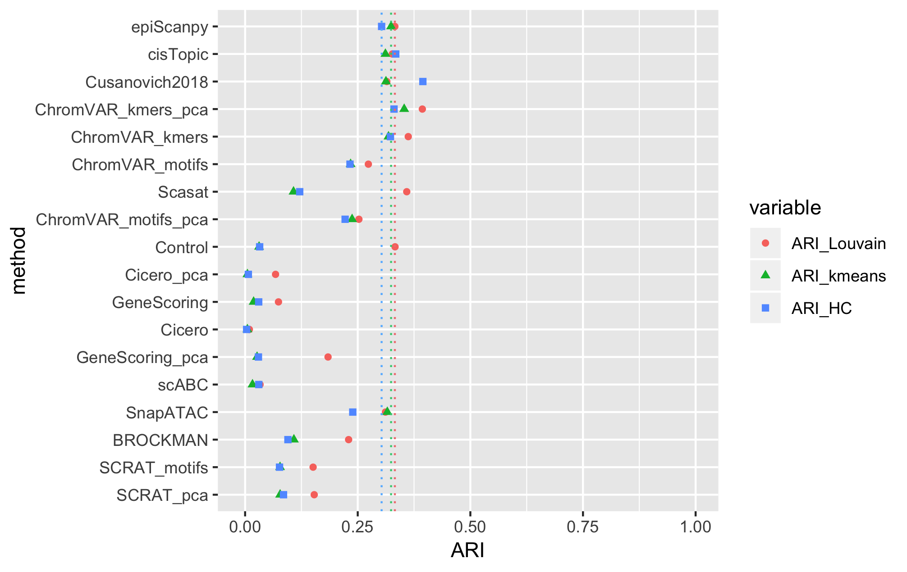

# episcanpy-benchmarking

Here you can find the scripts used for the benchmarking of epiScanpy to other scATACseq data processing methods using https://github.com/pinellolab/scATAC-benchmarking implementation (Huidong Chen, Caleb Lareau, Tommaso Andreani, Michael E. Vinyard, Sara P. Garcia, Kendell Clement, Miguel A. Andrade-Navarro, Jason D. Buenrostro & Luca Pinello. Assessment of computational methods for the analysis of single-cell ATAC-seq data. Genome Biology 20, 241 (2019).).

Due to the large size of the data, they are not directly available on Github. Send an email to anna.danese@helmholtz-muenchen.de and we will make them available.

The results in terms of ARI, AMI and homogeneity is shown in the figures below:

## Buenrostro et al 2018 (bulk peaks)
HERE UMAP FIGURE from powerpoint

## Buenrostro et al 2018
HERE UMAP FIGURE from powerpoint

## Cusanovich et al whole atlas
HERE UMAP FIGURE from powerpoint

## Cusanovich et al subsampled atlas
HERE UMAP FIGURE from powerpoint

